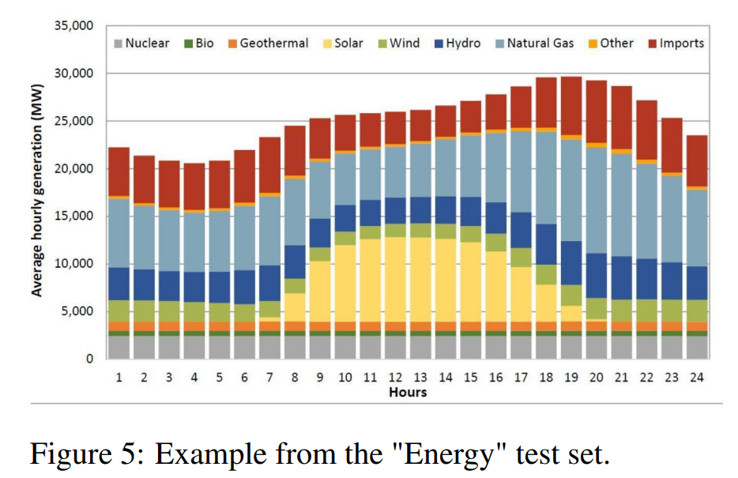
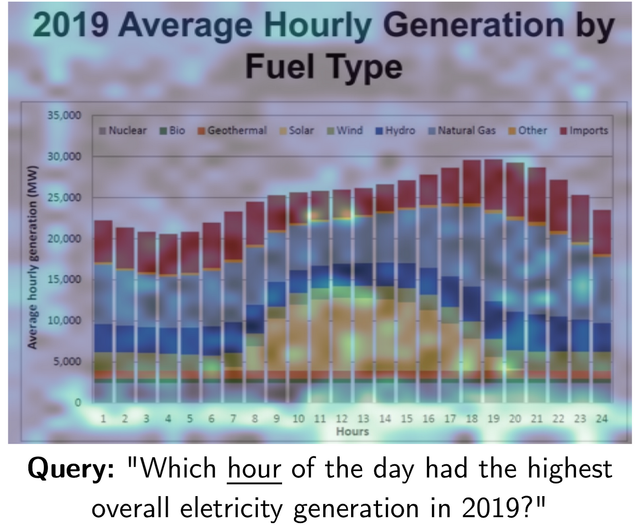

# Document Retrieval Using Computer Vision: ColPali vs. Standard Retrieval

## Standard Retrieval vs. ColPali

In the **standard retrieval approach**, Optical Character Recognition (OCR) is first applied to extract the text from a document. After text extraction, a layout detection model interprets the document’s structure, followed by chunking the text into smaller sections for embedding. This method works well for documents where the focus is primarily on the textual content.

  

In contrast, **ColPali** processes the entire document as an image using a Vision Encoder. This method generates multi-vector embeddings that capture both the textual content and the visual structure of the document. These embeddings are then passed through a Language Model (LLM), which integrates the information to produce a representation that retains both text and visual features.

## Why ColPali’s Results Are So Effective

One of the standout features of **ColPali** is its **explainability**. Since it uses Vision Transformers, the model can "understand" which parts of a document are most relevant to a specific query. For example, if you are searching for a particular date in a report, ColPali can highlight the areas of the document where that information is found. This transparency is incredibly useful for understanding how the model works and verifying the accuracy of its results.

Let’s take a look at the chart below from the original **ColPali paper**, showing the **2019 Average Hourly Generation by Fuel Type**:

In the figure below, also from the **ColPali paper**, you can see how ColPali identifies the most relevant patches of the document in response to the query: "Which hour of the day had the highest overall electricity generation in 2019?" ColPali matches the query terms like “hour” and “highest generation” to the relevant sections of the document.

The highlighted zones correspond to the areas of the document that contain information relevant to the query. ColPali computes a **query-to-page matching score** based on these highlighted regions, allowing it to retrieve the most pertinent documents from a large pre-indexed corpus.

*All Images from the ColPali paper*
